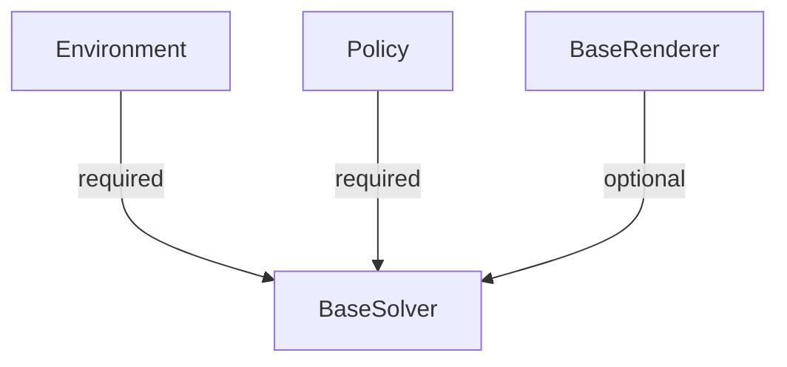
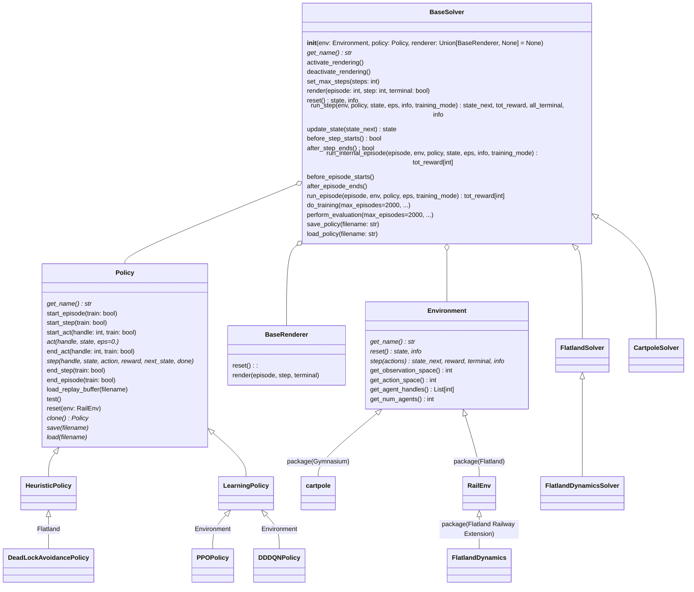
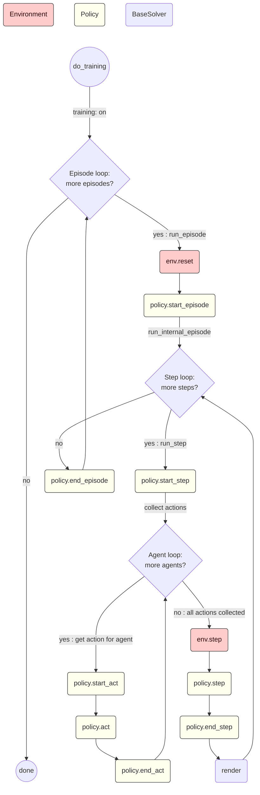

# Flatland Solver

## Solving the Flatland problem

Policy abstraction makes it possible to solve the flatland problem in a very accurate way. The user does not have to
care about flatland integration.

The goal of this library is to allow the user to easily extend the abstract policy to solve the flatland problem.
The user just needs to create an environment and a policy (solver) to solve the flatland problem. Rendering can be added
as an option.
The policy can be a learned one or a manual written heuristic or even any other solver/idea.
The observation can as well exchanged through the abstraction.
If reinforcement learning is not used, the observation can be replaced by the dummy observation.

## One solver for multiple environments and policy

The **[BaseSolver](https://github.com/aiAdrian/flatland_solver_policy/blob/main/solver/base_solver.py)** requires an
**[Environment](https://github.com/aiAdrian/flatland_solver_policy/blob/main/environment/environment.py)** and a 
**[Policy](https://github.com/aiAdrian/flatland_solver_policy/blob/main/policy/policy.py)**. The
BaseRenderer can be optionally enabled.



### Class diagram

The class diagram shows the most important classes and their dependencies, generalization and specialization of
Environment, BaseSolver and Policy.



### Solver

The following flowchart explains the main flow of Solver.do_training() and the respective calls to the abstract policy
and environment methods. The implementation of the Policy significantly controls the environmental behavior. The
environment must have implemented the reset and step method. The reset method returns the initial state (observation)
and an info dict. The step method needs a dict with all actions (for each agent one action) and returns the next state (
observation), reward, done signals (terminate) and an info.



### [Examples](https://github.com/aiAdrian/flatland_solver_policy/tree/main/example                                                  )

First, an environment must be created and the action space and observation space must be determined. The action space
and the state space are needed for policy creation.

```python
observation_builder = FlattenTreeObsForRailEnv(
    max_depth=3,
    predictor=ShortestPathPredictorForRailEnv(max_depth=50)
)

env, obs_space, act_space = FlatlandDynamicsEnvironment(obs_builder_object=observation_builder,
                                                        number_of_agents=10)
solver = FlatlandDynamicsSolver(env, PPOPolicy(obs_space, act_space))
solver.perform_training(max_episodes=1000)
solver.perform_evaluation(max_episodes=1000)
```                                                                

### Environments

Environments which are tested:

#### Flatland

- [**Flatland**](https://github.com/flatland-association/flatland-rl)
    - [RailEnv](https://github.com/flatland-association/flatland-rl/blob/main/flatland/envs/rail_env.py)
- [**Flatland Railway Extension**](https://github.com/aiAdrian/flatland_railway_extension)
    - [FlatlandDynamics](https://github.com/aiAdrian/flatland_railway_extension/blob/master/flatland_railway_extension/environments/FlatlandDynamics.py)

#### Non Flatland

- [Gymnasium](https://github.com/Farama-Foundation/Gymnasium):
    - [cartpole](https://github.com/Farama-Foundation/Gymnasium/blob/main/gymnasium/envs/classic_control/cartpole.py)
- [ma-gym](https://github.com/koulanurag/ma-gym)
    - [checkers](https://github.com/aiAdrian/flatland_solver_policy/blob/main/example/ma_gym/example_checkers.py)
    - [combat](https://github.com/aiAdrian/flatland_solver_policy/blob/main/example/ma_gym/example_combat.py)
    - [lumberjacks](https://github.com/aiAdrian/flatland_solver_policy/blob/main/example/ma_gym/example_lumberjacks.py)
    - [pong duel](https://github.com/aiAdrian/flatland_solver_policy/blob/main/example/ma_gym/example_pong_duel.py)
    - [predator prey 5x5](https://github.com/aiAdrian/flatland_solver_policy/blob/main/example/ma_gym/example_predator_prey_5x5.py)
    - [predator prey 7x7](https://github.com/aiAdrian/flatland_solver_policy/blob/main/example/ma_gym/example_predator_prey_7x7.py)
    - [switch 2](https://github.com/aiAdrian/flatland_solver_policy/blob/main/example/ma_gym/example_switch_2.py)
    - [switch 4](https://github.com/aiAdrian/flatland_solver_policy/blob/main/example/ma_gym/example_switch_4.py)
    - [traffic junction 4](https://github.com/aiAdrian/flatland_solver_policy/blob/main/example/ma_gym/example_traffic_junction_4.py)
    - [traffic junction 10](https://github.com/aiAdrian/flatland_solver_policy/blob/main/example/ma_gym/example_traffic_junction_10.py)

### Policy
All [policy](https://github.com/aiAdrian/flatland_solver_policy/tree/main/policy) have to implement the [policy interface](https://github.com/aiAdrian/flatland_solver_policy/blob/main/policy/policy.py).

- [Random](https://github.com/aiAdrian/flatland_solver_policy/blob/main/policy/random_policy.py)

#### [HeuristicPolicy](https://github.com/aiAdrian/flatland_solver_policy/tree/main/policy/heuristic_policy)
- [Flatand:DeadLockAvoidancePolicy](https://github.com/aiAdrian/flatland_solver_policy/blob/main/policy/heuristic_policy/shortest_path_deadlock_avoidance_policy/deadlock_avoidance_policy.py)

#### [Learning Policy](https://github.com/aiAdrian/flatland_solver_policy/tree/main/policy/learning_policy) 
- [Advantage Actor-Critic (A2CPolicy)](https://github.com/aiAdrian/flatland_solver_policy/blob/main/policy/learning_policy/a2c_policy/a2c_agent.py)
- [Dueling Double DQN (DDDQNPolicy)](https://github.com/aiAdrian/flatland_solver_policy/blob/main/policy/learning_policy/dddqn_policy/dddqn_policy.py)
- [Proximal Policy Optimization (PPOPolicy)](https://github.com/aiAdrian/flatland_solver_policy/blob/main/policy/learning_policy/ppo_policy/ppo_agent.py)
- [Twin Delayed Deep Deterministic Policy Gradients (T3DPolicy)](https://github.com/aiAdrian/flatland_solver_policy/blob/main/policy/learning_policy/td3_policy/td3_agent.py)

### Environment - Policy Support Matrix

| Policy                   | RailEnv | Flatland Dynamics | cartpole | checkers | combat  | lumberjacks | pong duel | predator prey 5x5 | predator prey 7x7 | switch 2 | switch 4 | traffic junction 4 | traffic junction 10 |
|--------------------------|---------|-------------------|----------|----------|---------|-------------|-----------|-------------------|-------------------|----------|----------|--------------------|---------------------|
| CartpoleAnalyticalPolicy |         |                   | **yes**  |          |         |             |           |                   |                   |          |          |                    |                     |
| RandomPolicy             | **yes** | **yes**           | **yes**  | **yes**  | **yes** | **yes**     | **yes**   | **yes**           | **yes**           | **yes**  | **yes**  | **yes**            | **yes**             |
| A2CPolicy                | **yes** | **yes**           | **yes**  | **yes**  | **yes** | **yes**     | **yes**   | **yes**           | **yes**           | **yes**  | **yes**  | **yes**            | **yes**             |
| DDDQNPolicy              | **yes** | **yes**           | **yes**  | **yes**  | **yes** | **yes**     | **yes**   | **yes**           | **yes**           | **yes**  | **yes**  | **yes**            | **yes**             |
| PPOPolicy                | **yes** | **yes**           | **yes**  | **yes**  | **yes** | **yes**     | **yes**   | **yes**           | **yes**           | **yes**  | **yes**  | **yes**            | **yes**             |
| T3DPolicy                | **yes** | **yes**           | **yes**  | **yes**  | **yes** | **yes**     | **yes**   | **yes**           | **yes**           | **yes**  | **yes**  | **yes**            | **yes**             |
| DeadLockAvoidancePolicy  | **yes** | **yes**           |          |          |         |             |           |                   |                   |          |          |                    |                     |

### Tensorboard

Training / quality logging is done with tensorboard. Navigate to the example folder
and call ``tensorboard --logdir runs``

### Future integration ideas

[MARL-Algorithms](https://github.com/starry-sky6688/MARL-Algorithms/tree/master)