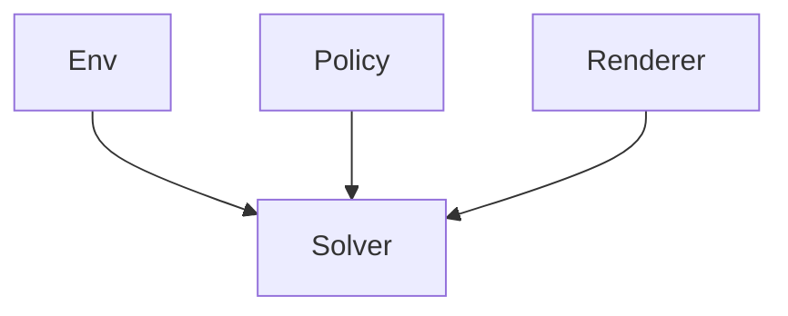
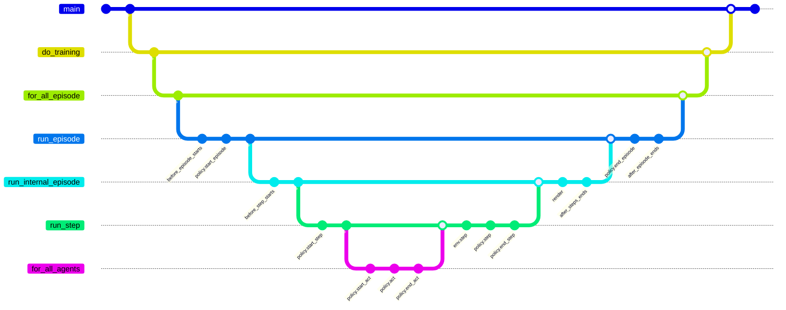

# Flatland Solver

## Solving the Flatland problem

Policy abstraction makes it possible to solve the flatland problem in a very accurate way. The user does not have to
care about flatland integration.

The goal of this library is to allow the user to easily extend the abstract policy to solve the flatland problem.
The user just needs to create an environment and a policy (solver) to solve the flatland problem. Rendering can be added
as an option.
The policy can be a learned one or a manual written heuristic or even any other solver/idea.
The observation can as well exchanged through the abstraction.
If reinforcement learning is not used, the observation can be replaced by the dummy observation.

## One solver for multiple environments and policy
 
### API 
[Policy](https://github.com/aiAdrian/flatland_solver_policy/blob/main/policy/policy.py)

[BaseSolver](https://github.com/aiAdrian/flatland_solver_policy/blob/main/solver/base_solver.py)






 


Solver-->do_training;
do_training-->for_all_episode;
for_all_episode-->run_episode;
run_episode-->before_episode_starts;  
run_episode-->policy.start_episode;  
run_episode-->run_internal_episode;   
run_episode-->policy.end_episode;  
run_episode-->after_episode_ends;
run_internal_episode-->before_step_starts
run_internal_episode-->run_step
run_internal_episode-->render
run_internal_episode-->after_steps_ends
run_step-->policy.start_step
run_step-->for_all_agents
for_all_agents-->policy.start_act
for_all_agents-->policy.act 
for_all_agents-->policy.end_act 
run_step-->env.step
run_step-->policy.step
run_step-->policy.end_step
 


### Examples

#### Cartpool                                                                                                                 
```python 
env, obs_space, act_space = create_environment( ... )
solver = CartPoolSolver(env)

solver.set_policy(create_ppo_policy(obs_space, act_space))
solver.do_training(max_episodes=1000)

solver.set_policy(create_dddqn_policy(obs_space, act_space))
solver.do_training(max_episodes=1000)
```                   

#### Flatland                                                                                                                 
```python
env, obs_space, act_space = create_environment( ... )
solver = FlatlandSolver(env)

solver.set_policy(create_ppo_policy(obs_space, act_space))
solver.do_training(max_episodes=1000)

solver.set_policy(create_dddqn_policy(obs_space, act_space))
solver.do_training(max_episodes=1000)
```                                                              

#### Flatland Dynamics      
```python
env, obs_space, act_space = create_environment( ... )
solver = FlatlandDynamicsSolver(env)

solver.set_policy(create_ppo_policy(obs_space, act_space))
solver.do_training(max_episodes=1000)

solver.set_policy(create_dddqn_policy(obs_space, act_space))
solver.do_training(max_episodes=1000)
```                                                                


### Implemented environments (examples)

Environments which can be used and are tested:

#### [Gymnasium](https://github.com/Farama-Foundation/Gymnasium)

- Environments:
    - [Cartpool](https://github.com/aiAdrian/flatland_solver_policy/blob/main/example/gymnasium_cartpool/example_cartpool.py)


- Policy:
    - Learning policy
        - [DDDQNPolicy](https://github.com/aiAdrian/flatland_solver_policy/blob/main/policy/learning_policy/dddqn_policy/dddqn_policy.py)
        - [PPOPolicy](https://github.com/aiAdrian/flatland_solver_policy/blob/main/policy/learning_policy/ppo_policy/ppo_agent.py)
    - [AnalyticalPolicy](https://github.com/aiAdrian/flatland_solver_policy/blob/main/example/gymnasium_cartpool/cartpool_analytical_policy.py)


- Extras:
    - [Rendering](https://github.com/aiAdrian/flatland_solver_policy/blob/main/example/gymnasium_cartpool/cartpool_renderer.py)

#### [Flatland](https://github.com/flatland-association/flatland-rl)

- Environments:
    - [Flatland](https://github.com/aiAdrian/flatland_solver_policy/blob/main/example/flatland_rail_env/example_flatland.py)
    - [Flatland Dynamics](https://github.com/aiAdrian/flatland_solver_policy/blob/main/example/flatland_dynamics/example_flatland_dynamics.py)


- Policy:
    - Learning policy
        - [DDDQNPolicy](https://github.com/aiAdrian/flatland_solver_policy/blob/main/policy/learning_policy/dddqn_policy/dddqn_policy.py)
        - [PPOPolicy](https://github.com/aiAdrian/flatland_solver_policy/blob/main/policy/learning_policy/ppo_policy/ppo_agent.py)
    - Heuristic policy
        - [DeadLockAvoidancePolicy](https://github.com/aiAdrian/flatland_solver_policy/blob/main/policy/heuristic_policy/shortest_path_deadlock_avoidance_policy/deadlock_avoidance_policy.py)


- Extras:
    - Rendering

Training / quality logging is done with tensorboard. Navigate to the example folder
and call ``tensorboard --logdir runs``
