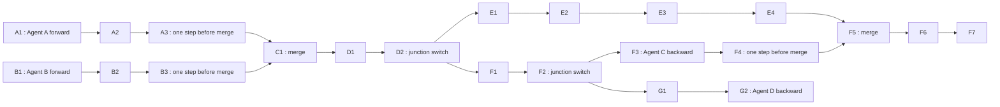
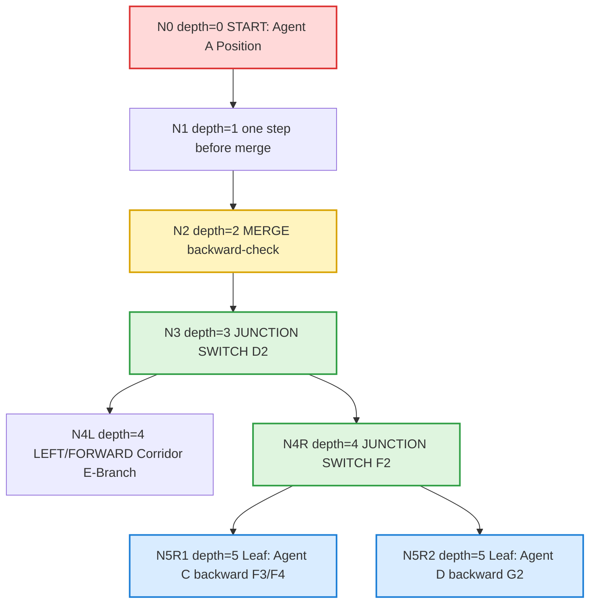

# Flatland Observation Dokumentation (Stand: Mai 2026)

Dieses Dokument erklaert die aktuelle Observation-Architektur fuer das MARL-Training in Flatland so, dass man sie praktisch verwenden, debuggen und erweitern kann.

Ziel:
- klar verstehen, wie `_local_search` arbeitet
- klar sehen, was deterministisch ist und was lernbar ist
- den `tree_payload` fuer lernbare Encoder korrekt nutzen
- `search_depth` fachlich sinnvoll waehlen
- tiefe Suchen performant halten (Sampling, Kontraktion, Node-Budget)

## 1. Gesamtidee in einem Satz

Die Observation kombiniert einen kompakten Feature-Vektor mit einer strukturierten lokalen Suchbaum-Repräsentation, damit die Policy nicht nur statische Heuristiken sieht, sondern auch topologische Konfliktmuster lernbar encoden kann.

## 2. Was passiert pro Zeitschritt?

Pro Agent in `DecisionPointObservation.get(handle)`:
1. Grundzustand lesen (Position, Richtung, Target, DistanceMap, Transitions).
2. Lokale Suche `_local_search(...)` bis `search_depth` ausfuehren.
3. Aus dem Baum entstehen:
   - `nodes`
   - `edges`
   - `seen_agents`
   - `visited_states`
4. Daraus werden zwei Kanaele gebildet:
   - Kanal A: `raw_features` (aktuell 155D)
   - Kanal B: `tree_payload` in `env.dev_tree_dict[handle]`
5. Rueckgabe: `(raw_features, opp_agents)`

Wichtig:
- `raw_features` enthaelt bereits serialisierte Tree-Information (`[35:155]`).
- Der volle Baum bleibt zusaetzlich in `tree_payload` erhalten (keine Information geht verloren).

## 2.1 Local tree search im Detail (_local_search)

Die lokale Suche ist eine begrenzte Graph-Expansion pro Agent und Zeitschritt.
Ziel ist nicht ein globaler Plan, sondern ein lokaler Konflikt- und Topologie-
Ausschnitt, der stabil trainierbar bleibt.

Ablauf pro Aufruf:
1. Start bei `(start_pos, start_dir, depth=0)` mit Frontier.
2. Best-depth-Pruning pro Zustand `(pos, dir)`:
  - ein Zustand wird nur erweitert, wenn er auf kleinerer Tiefe erreicht wird.
3. Harte Budgetierung:
  - `max_nodes = _compute_adaptive_node_budget(...)`
  - sobald `len(nodes) >= max_nodes`, wird die Expansion beendet.
4. Branch-Auswahl je Knoten:
  - kuerzester Distanz-Branch bleibt immer erhalten
  - Side-Branches werden je nach Modus (`stochastic` oder `mcts`) selektiert.
5. Korridor-Kontraktion (optional, ab `tree_contract_depth`):
  - lineare Segmente werden zu einer Kante zusammengezogen
  - `edge_len_cells` speichert die reale Segmentlaenge.
6. Node-Risiko:
  - `_calculate_deadlock_risk(...)` liefert Basissignal
  - Oncoming + Backward-Inflow erhoehen das Risiko additiv (geclippt auf `[0,1]`).
7. Aggregation:
  - `seen_agents` sammelt Gegner aus Knoten, Kanten und Inflow-Scans.

Wichtige Invarianten:
- Variable Groesse ist beabsichtigt: Anzahl `nodes`/`edges` kann pro Agent/Step
  stark variieren.
- Suche bleibt robust: bei Fehlern wird ein leeres Payload statt Crash geliefert.
- Kuerzester Pfad wird trotz Sampling/MCTS nicht verworfen.

Payload-Felder und Bedeutung:
- `nodes[*].num_transitions`: lokale Verzweigungsstarke am Zustand.
- `nodes[*].deadlock_risk`: heuristisches Konfliktsignal fuer diesen Knoten.
- `nodes[*].incoming_agents`: Gegner, die in den Knoten einlaufen koennen.
- `edges[*].rel_dir_bin`: relative Richtung Left/Forward/Right.
- `edges[*].edge_len_cells`: komprimierte Segmentlaenge nach Kontraktion.
- `seen_agents`: sortierte Menge lokal sichtbarer Gegner-IDs.

## 3. Datenfluss (von Rail-Graph bis Policy)

```mermaid
flowchart TD
    A[Flatland Rail Graph + Agent State] --> B[DecisionPointObservation.get(handle)]
    B --> C[_local_search(handle, pos, dir, search_depth)]
    C --> D1[tree_payload.nodes]
    C --> D2[tree_payload.edges]
    C --> D3[tree_payload.seen_agents]
    C --> D4[tree_payload.visited_states]

    B --> E[raw_features 155D]
    D1 --> E
    D2 --> E

    E --> F[TemporalMultiAgentObservation]
    D3 --> F

    F --> G[Policy Encoder]
    D1 --> H[Optional: Graph Encoder / TreeLSTM / TreeTransformer]
    D2 --> H
    H --> G

    G --> I[Actor/Critic Output]
```

## 4. Beispiel-Topologie (Input Graph)



Dieses Beispiel zeigt genau den Fall, fuer den die lokale Suche gebaut ist:
- mehrere Merge-Zonen
- ein Switch mit konkurrierenden Aesten
- Gegenverkehr (oncoming)
- rueckwaerts einstroemende Agenten

## 5. Beispiel: Lokaler Suchbaum



Interpretation:
- Die Suche ist lokal und tiefenbegrenzt, aber strukturiert.
- Merge- und Switch-Bereiche liefern hohe Informationsdichte.
- Backward-Inflows werden als Konfliktsignal explizit modelliert.

## 6. Aktuelles Feature-Layout (DecisionPointObservation)

Aktuelle Groesse: `OBS_SIZE = 155`

Bloecke:
- `[0:35]` Basiskontext und zusammengefasste Statistik
  - decision/switch/merge Hinweise
  - local deadlock
  - state/action memory
  - priority/cell/transition coding
  - tree summary (mean/max deadlock, conflict density, branching)
- `[35:155]` serialisierte Baumknoten
  - max. 15 Knoten
  - je Knoten 8 Features

Formal:
- `MAX_NODES = 15`
- `NODE_DIM = 8`
- `15 * 8 = 120`
- `35 + 120 = 155`

## 7. tree_payload Schema (fuer lernbare Tree-Encoder)

```json
{
  "nodes": [
    {
      "pos": [r, c],
      "dir": direction,
      "depth": depth,
      "num_transitions": num,
      "deadlock_risk": 0.0,
      "agents_encountered": [1, 7],
      "has_oncoming": false,
      "incoming_agents": [3],
      "backward_inflow_count": 1
    }
  ],
  "edges": [
    {
      "src_pos": [r, c],
      "src_dir": direction,
      "dst_pos": [r2, c2],
      "dst_dir": direction2,
      "src_depth": 2,
      "dst_depth": 3,
      "rel_dir_bin": 1,
      "edge_len_cells": 1,
      "agents_on_edge": [3],
      "has_oncoming_edge": true
    }
  ],
  "seen_agents": [1, 3, 7],
  "visited_states": [[r, c, d, depth], [r2, c2, d2, depth2]]
}
```

Hinweis:
- `tree_payload` ist absichtlich variabel in Form und Groesse.
- Genau das erlaubt robuste Encoder fuer unterschiedlich grosse und asymmetrische Baeume.

## 8. Was ist lernbar, was ist deterministisch?

Deterministisch (heuristisch, ohne Gradienten):
- `_local_search` Traversierung
- `deadlock_risk` Basisschaetzung
- Baum-Serialisierung in fixe Slots

Lernbar (ueber PPO/Backprop in der Policy):
- Gewichtung und Kombination aller Feature-Signale im Policy-Netz
- Interaktion zwischen Ego-Features, Opponent-Features und Zeitfenster
- Optional: separater Tree-Encoder (z. B. TreeLSTM/GAT/Transformer)

Wichtige Designentscheidung:
- Die Heuristik liefert nur strukturierte Kandidatensignale.
- Die eigentliche Aggregation fuer Entscheidungen soll von der Policy gelernt werden.

## 9. Vorschlag fuer lernbaren Tree-Pfad

Minimal-invasive Variante:
1. `tree_payload` aus `env.dev_tree_dict[handle]` im Trainingspfad abholen.
2. Node/Edge-Listen in ein Batch-Format bringen (padding + masks).
3. Tree-Encoder bauen:
   - Option A: TreeLSTM
   - Option B: Graph Attention (GAT)
   - Option C: Transformer ueber DFS-Sequenz + edge features
4. Tree-Embedding mit dem bestehenden Policy-Embedding fusionieren.
5. End-to-End mit Actor/Critic trainieren.

Empfohlene Fusion:
- `h_policy = concat(h_obs, h_tree, h_comm)`
- danach gemeinsamer MLP-Block fuer Actor/Critic Heads

## 10. Search-Performance: neue Steuerhebel

Die lokale Suche unterstuetzt jetzt mehrere Performance-Hebel, die zusammen tiefe Baeume praktikabel machen:

1. Branch-Selektion ab Tiefe X
- `--tree_random_start_depth`
- `--tree_max_side_branches`
- `--tree_distance_bias`

2. Optionales MCTS-lite fuer Branch-Auswahl
- `--tree_mode stochastic|mcts`
- `--tree_mcts_rollouts`
- `--tree_mcts_horizon`
- `--tree_ucb_c`

3. Strukturkompression und hartes Budget
- `--tree_contract_depth` (lineare Korridore zu einer Kante zusammenziehen)
- `--tree_max_nodes` (maximale Knoten pro Agent/Step)

4. Begrenzte Deadlock-Probes im Node-Scoring
- `--tree_deadlock_probe_depth` (Suchtiefe pro Deadlock-Probe)
- `--tree_deadlock_max_states` (maximale Zustaende pro Deadlock-Probe)

6. Numerische Stabilitaet der Tree-Features
- `--tree_clip_features on|off`

5. Adaptives Node-Budget pro Agent/Step
- `--tree_adaptive_budget on|off`
- `--tree_min_nodes`
- `--tree_max_nodes`
- `--tree_adaptive_branch_bonus`
- `--tree_adaptive_conflict_bonus`
- `--tree_adaptive_depth_bonus`

Adaptive Budget Idee:
- einfache Szenen: Budget nahe `tree_min_nodes`
- Merge/Conflict-Hotspots und tiefere Suche: Budget steigt dynamisch
- harte Obergrenze bleibt `tree_max_nodes`

Praktisch verwendete Heuristik:
- Start bei `tree_min_nodes`
- + Bonus fuer zusaetzliche Root-Branches
- + Bonus fuer Konflikt-/Merge-Umgebung
- + Bonus fuer hohe `search_depth`
- danach clamp in `[tree_min_nodes, tree_max_nodes]`

Wichtig:
- kuerzester Pfad bleibt immer erhalten
- Kontraktion startet erst ab `tree_contract_depth`
- `edge_len_cells` signalisiert dem Encoder, wie viele Zellen zusammengezogen wurden
- Deadlock-Probe ist bewusst begrenzt, damit `_local_search` nicht durch teure Vollgraph-Scans dominiert wird
- adaptives Budget reduziert Kosten in einfachen Szenen ohne Konflikt-Qualitaet in harten Szenen zu verlieren
- Knoten-Tiefe im serialisierten Tree wird mit `search_depth` normalisiert (nicht hart mit 5)
- optionales Clipping (`tree_clip_features=on`) haelt den serialisierten Tree-Block in [0,1]

## 11. search_depth: fachliche Empfehlung

`search_depth` bleibt ein Bias-Varianz-Performance-Hebel, jetzt aber mit besserer Laufzeitkontrolle.

Praxisleitfaden:
- `depth = 4`: schnell, aber begrenzte Merge-Vorschau
- `depth = 5..7`: stabiler Arbeitsbereich
- `depth = 8..12`: mit Kontraktion/Budget gut nutzbar

Empfohlenes Vorgehen:
1. Grid-Sweep auf kleinen Batches (`depth in {4,5,6}`).
2. Metriken vergleichen:
   - done rate
   - deadlock rate
   - steps/episode
   - wall-clock time
3. Tiefe waehlen, die deadlocks reduziert ohne starken Laufzeitverlust.

Regel:
- Wenn viele Konflikte erst hinter dem ersten Merge sichtbar werden, ist `depth=5` oft knapp und `depth=6` sinnvoll.

Empfohlene Start-Presets:

Preset A (schnell und robust):
```bash
--search_depth 8 \
--tree_mode stochastic \
--tree_adaptive_budget on \
--tree_min_nodes 20 \
--tree_random_start_depth 2 \
--tree_max_side_branches 1 \
--tree_distance_bias 2.5 \
--tree_contract_depth 6 \
--tree_max_nodes 40 \
--tree_adaptive_branch_bonus 5 \
--tree_adaptive_conflict_bonus 7 \
--tree_adaptive_depth_bonus 2 \
--tree_deadlock_probe_depth 5 \
--tree_deadlock_max_states 48 \
--tree_clip_features on
```

Preset B (tiefer, immer noch kontrolliert):
```bash
--search_depth 12 \
--tree_mode mcts \
--tree_adaptive_budget on \
--tree_min_nodes 24 \
--tree_mcts_rollouts 8 \
--tree_mcts_horizon 5 \
--tree_ucb_c 1.2 \
--tree_random_start_depth 2 \
--tree_max_side_branches 1 \
--tree_contract_depth 7 \
--tree_max_nodes 48 \
--tree_adaptive_branch_bonus 6 \
--tree_adaptive_conflict_bonus 8 \
--tree_adaptive_depth_bonus 2 \
--tree_deadlock_probe_depth 6 \
--tree_deadlock_max_states 64 \
--tree_clip_features on
```

Preset C (aggressiv auf Qualitaet, langsamer):
```bash
--search_depth 12 \
--tree_mode mcts \
--tree_adaptive_budget off \
--tree_min_nodes 72 \
--tree_mcts_rollouts 12 \
--tree_mcts_horizon 6 \
--tree_ucb_c 1.0 \
--tree_random_start_depth 1 \
--tree_max_side_branches 2 \
--tree_contract_depth 8 \
--tree_max_nodes 72 \
--tree_adaptive_branch_bonus 0 \
--tree_adaptive_conflict_bonus 0 \
--tree_adaptive_depth_bonus 0 \
--tree_deadlock_probe_depth 7 \
--tree_deadlock_max_states 96 \
--tree_clip_features on
```

## 12. Deadlock-Erkennung und Logging

Aktuell ist Deadlock-Erkennung an zwei Stellen relevant:
- Observation/Utils fuer Deadlock-Signal in Features
- Solver-Logging fuer Episode-Statistik

Wenn kein Reward-Shaper aktiv ist, muss Deadlock-Logging trotzdem funktionieren.
Dafuer wurde ein Fallback im Solver eingebaut:
- zuerst Reward-Shaper-Wert (falls vorhanden)
- sonst direkte Schaetzung aus Environment + `DecisionPointUtils`

Damit bleibt die Ausgabe `dead locks` aussagekraeftig.

## 13. Troubleshooting

Wenn deadlocks immer 0 sind:
- pruefen, ob Agenten on-map sind (position gesetzt)
- pruefen, ob `DecisionPointUtils` importierbar ist
- pruefen, ob Environment ein gueltiges `rail` und `agents` bereitstellt

Wenn zu viele false positives auftreten:
- `search_depth` nicht sofort stark erhoehen
- zuerst Korridor-Timeout und Gegenverkehrsfaelle in Logs gegenpruefen
- Merge/Switch-Hotspots separat evaluieren

Wenn Laufzeit zu hoch ist:
- `tree_adaptive_budget=on` setzen (falls aus)
- zuerst `tree_max_nodes` reduzieren (z. B. 48 -> 32)
- `tree_min_nodes` reduzieren (z. B. 24 -> 16)
- dann `tree_contract_depth` verkleinern (z. B. 7 -> 6)
- bei `tree_mode=mcts`: `tree_mcts_rollouts` senken
- `tree_deadlock_probe_depth` und `tree_deadlock_max_states` senken
- zuletzt `search_depth` reduzieren

Wenn die Policy "zu kurzsichtig" wirkt:
- `search_depth` erhoehen
- `tree_min_nodes` erhoehen
- `tree_contract_depth` erhoehen (spaeter kontrahieren)
- bei `tree_mode=mcts`: `tree_mcts_horizon` leicht erhoehen
- `tree_max_nodes` nicht zu klein waehlen

## 14. Fazit

Die aktuelle Architektur ist geeignet fuer alle denkbaren lokalen Baumformen:
- unterschiedliche Tiefe
- unterschiedliche Breite
- ungleichmaessige Aeste
- wechselnde Anzahl von Knoten und Kanten

Genau deshalb ist die Kombination aus:
- fixer Beobachtung fuer Basissignale
- plus vollem `tree_payload` fuer lernbare Aggregation

fachlich sauber und zukunftssicher fuer weitere Encoder-Experimente.
