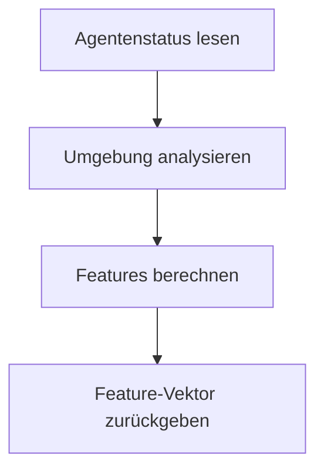

# Flatland Multi-Agent Observations – Übersicht & Feature-Design

Diese Dokumentation beschreibt alle wichtigen Beobachtungsklassen (Observations) für Multi-Agenten-Umgebungen im Flatland-Railway-Setting. Sie legt besonderen Fokus auf die Feature-Struktur, Entscheidungslogik und die Unterschiede zwischen den Klassen. **Jede Klasse wird mit maximaler Detailtiefe, Schritt-für-Schritt-Logik und exakten Feature-Beschreibungen erläutert.**

---

## 1. ExperimentalObservation

**Zweck:**
Die `ExperimentalObservation` ist eine generische, 30-dimensionale Beobachtung für jeden Agenten. Sie liefert eine vollständige Zustandsbeschreibung, die als Basis für komplexere Observations dient.

**Interne Logik & Ablauf:**
1. **Agentenstatus erfassen:** Position, Richtung, Ziel, Status werden aus dem Agentenobjekt gelesen.
2. **Umgebungsanalyse:** Die Umgebung (z.B. Weichen, andere Agenten) wird analysiert, indem Hilfsklassen wie `RailroadSwitchAnalyser` und ein Walker verwendet werden.
3. **Feature-Berechnung:**
	- Die ersten Features kodieren die eigene Position, Richtung, Zielkoordinaten und Status.
	- Weitere Features können Distanzen, Deadlock-Flags, Agenten in der Nähe oder andere relevante Metriken enthalten.
4. **Multi-Agenten-Features:** Optional werden Informationen über andere Agenten (z.B. relative Positionen) ergänzt.

**Feature-Bedeutung (Beispiel):**
| Index | Bedeutung                |
|-------|--------------------------|
| 0     | eigene x-Position        |
| 1     | eigene y-Position        |
| 2     | Richtung                 |
| 3     | Status (enum)            |
| 4     | Handle (Agenten-ID)      |
| ...   | ...                      |

**Ablaufdiagramm:**

---

## 2. DecisionPointObservation

### 2.1 Einleitung und Funktionsweise

Die `DecisionPointObservation` ist die zentrale Beobachtungsklasse für alle kritischen Entscheidungssituationen im Flatland-Setting. Sie liefert einen 30-dimensionalen, klar strukturierten Feature-Vektor, der für jede Situation (Start, Weiche, Merge/Crossing) einen eigenen, disjunkten Block belegt. Ziel ist es, der Policy für jede relevante Richtung eine vollständige, konfliktbewusste Einschätzung zu ermöglichen.

### 2.2 Feature-Block-Übersicht (32D)

Der Feature-Vektor ist exakt wie folgt aufgebaut (Index 0–31):

| Index | Feature-Name (Switch)                | Beschreibung (Switch)                                                                 | Feature-Name (Merge/Crossing)         | Beschreibung (Merge/Crossing)                                  |
|-------|--------------------------------------|--------------------------------------------------------------------------------------|---------------------------------------|---------------------------------------------------------------|
| 0     | decision_type                        | Typ der Entscheidungssituation (0=Standard, 1=Start, 2=Weiche, 3=Merge/Crossing)    | decision_type                         | wie links                                                     |
| 1     | one-hot_left                         | 1, wenn links der beste Pfad ist, sonst 0                                            | one-hot_left                          | wie links                                                     |
| 2     | one-hot_forward                      | 1, wenn geradeaus der beste Pfad ist, sonst 0                                        | one-hot_forward                       | wie links                                                     |
| 3     | one-hot_right                        | 1, wenn rechts der beste Pfad ist, sonst 0                                           | one-hot_right                         | wie links                                                     |
| 4     | left_dist                            | Maximale Distanz auf dem Zielpfad (bis Ziel, Deadlock oder max_steps), wenn nach links abgebogen wird | –                                     | –                                                             |
| 5     | left_deadlock                        | 1, falls Deadlock auf linkem Pfad, sonst 0                                           | –                                     | –                                                             |
| 6     | left_switches                        | Anzahl der Pfadwechsel (an Weichen) auf linkem Pfad                                  | –                                     | –                                                             |
| 7     | left_delta_dist                      | Distanzdifferenz zum Ziel nach Schritt nach links                                    | –                                     | –                                                             |
| 8     | forward_dist                         | Maximale Distanz auf dem Zielpfad (bis Ziel, Deadlock oder max_steps), wenn geradeaus gegangen wird | –                                     | –                                                             |
| 9     | forward_deadlock                     | 1, falls Deadlock auf geradem Pfad, sonst 0                                          | –                                     | –                                                             |
| 10    | forward_switches                     | Anzahl der Pfadwechsel (an Weichen) auf geradem Pfad                                 | –                                     | –                                                             |
| 11    | forward_delta_dist                   | Distanzdifferenz zum Ziel nach Schritt geradeaus                                     | –                                     | –                                                             |
| 12    | right_dist                           | Maximale Distanz auf dem Zielpfad (bis Ziel, Deadlock oder max_steps), wenn nach rechts abgebogen wird | –                                     | –                                                             |
| 13    | right_deadlock                       | 1, falls Deadlock auf rechtem Pfad, sonst 0                                          | –                                     | –                                                             |
| 14    | right_switches                       | Anzahl der Pfadwechsel (an Weichen) auf rechtem Pfad                                 | –                                     | –                                                             |
| 15    | right_delta_dist                     | Distanzdifferenz zum Ziel nach Schritt nach rechts                                   | –                                     | –                                                             |
| 16    | reverse_dist                         | Maximale Distanz auf dem Zielpfad (bis Ziel, Deadlock oder max_steps), wenn rückwärts gegangen wird | –                                     | –                                                             |
| 17    | reverse_deadlock                     | 1, falls Deadlock auf rückwärtigem Pfad, sonst 0                                     | –                                     | –                                                             |
| 18    | reverse_switches                     | Anzahl der Pfadwechsel (an Weichen) auf rückwärtigem Pfad                            | –                                     | –                                                             |
| 19    | reverse_delta_dist                   | Distanzdifferenz zum Ziel nach Schritt rückwärts                                     | –                                     | –                                                             |
| 20    | forward_dist_merge                   | –                                                                                    | forward_dist                          | wie oben, für Merge/Crossing                                  |
| 21    | forward_deadlock_merge               | –                                                                                    | forward_deadlock                      | wie oben, für Merge/Crossing                                  |
| 22    | forward_switches_merge               | –                                                                                    | forward_switches                      | wie oben, für Merge/Crossing                                  |
| 23    | forward_delta_dist_merge             | –                                                                                    | forward_delta_dist                    | wie oben, für Merge/Crossing                                  |
| 24    | backward_dist_merge                  | –                                                                                    | backward_dist                         | wie oben, für Merge/Crossing                                  |
| 25    | backward_deadlock_merge              | –                                                                                    | backward_deadlock                     | wie oben, für Merge/Crossing                                  |
| 26    | backward_switches_merge              | –                                                                                    | backward_switches                     | wie oben, für Merge/Crossing                                  |
| 27    | backward_delta_dist_merge            | –                                                                                    | backward_delta_dist                   | wie oben, für Merge/Crossing                                  |
| 28    | delta_dist_fwd (nur Start)           | Distanzdifferenz zum Ziel nach Startschritt                                          | delta_dist_fwd (nur Start)            | wie links                                                     |
| 29    | abort                                | 1, wenn die maximale Schrittzahl (max_steps) überschritten wurde, sonst 0            | abort                                 | wie links                                                     |
| 30    | target_found                         | 1, wenn das Ziel auf dem Pfad erreicht wurde, sonst 0                                | target_found                          | wie links                                                     |
| 31    | reserved/extra/legacy                | (Optional: z.B. für Debug, Legacy, oder künftige Erweiterung, je nach Code)          | reserved/extra/legacy                 | wie links                                                     |

**Feature-Beschreibungen im Detail:**
- **decision_type:** Kodiert die aktuelle Entscheidungssituation (0=Standard, 1=Start, 2=Weiche, 3=Merge/Crossing).
- **one-hot_left/forward/right:** Zeigt an, welche Richtung aktuell am günstigsten ist (laut distance_map).
- **[left|forward|right|reverse]_dist:** Maximale Schrittzahl auf dem Zielpfad in die jeweilige Richtung (nicht zwingend direkte Distanz zum Ziel).
- **[left|forward|right|reverse]_deadlock:** 1, falls Deadlock erkannt, sonst 0.
- **[left|forward|right|reverse]_switches:** Anzahl der Pfadwechsel (an Weichen) auf dem Pfad.
- **[left|forward|right|reverse]_delta_dist:** Distanzdifferenz zum Ziel nach dem ersten Schritt in die jeweilige Richtung.
- **[forward|backward]_[...]_merge:** Wie oben, aber für Merge/Crossing-Situation (decision_type==3), jeweils für einen Schritt vorwärts oder rückwärts.
- **delta_dist_fwd:** Nur bei Start (decision_type==1) belegt; gibt an, wie sich die Distanz zum Ziel nach dem ersten Schritt verändert.
- **abort:** 1, wenn max_steps überschritten, sonst 0.
- **target_found:** 1, wenn Ziel erreicht, sonst 0.
- **reserved/extra/legacy:** Optionales Feld für Debugging, Legacy-Code oder künftige Erweiterungen (je nach Implementierung, siehe Code). Wird ggf. mit 0 belegt.

Jeder Block ist exklusiv für eine Entscheidungssituation reserviert. Die Werte werden nur für die jeweils relevante Situation gesetzt, alle anderen Felder bleiben 0.

### 2.3 Entscheidungslogik und Ablauf

1. **Status & Position:** Die aktuelle Position, Richtung und der Status des Agenten werden bestimmt.
2. **Klassifikation:** Mit Hilfe des `RailroadSwitchAnalyser` wird erkannt, ob der Agent startet, auf einer Weiche steht oder sich vor einer Weiche befindet.
3. **Blockauswahl:** Je nach Situation wird der passende Feature-Block belegt.
4. **Richtungsanalyse:** Für jede relevante Richtung werden Navigationsmetriken berechnet (siehe 2.4).
5. **Agenten-Interaktion:** Entgegenkommende Agenten werden erkannt und beeinflussen die Deadlock-Logik.

### 2.4 Algorithmus: _navigate_direction

**Algorithmus-Details: DecisionPointObservation und _navigate_direction**

Die Methode `_navigate_direction` implementiert eine rekursive Tiefensuche (DFS) mit Backtracking, um für jede relevante Richtung ab einer Startposition und -richtung den maximal erreichbaren Pfad zu simulieren. Die wichtigsten Schritte und Mechanismen sind:

1. **Initialisierung:**
	- Ein globaler Controller (dict) zählt die insgesamt besuchten Zellen (`count`), speichert alle besuchten (Position, Richtung)-Paare (`visited`) und alle auf dem Pfad gesehenen Agenten (`seen_agents`).
	- Die Suche startet an der gegebenen Position und Richtung.

2. **Abbruchbedingungen:**
	- **Ziel erreicht:** Wenn die Zielposition erreicht wird, wird sofort abgebrochen (`target_found=1`).
	- **Außerhalb des Grids:** Verlässt der Agent das Spielfeld, wird dies als Deadlock gewertet.
	- **Cycle Prevention:** Bereits besuchte (Position, Richtung)-Paare werden nicht erneut betreten, um Endlosschleifen zu verhindern.
	- **Kein Fortschritt möglich:** Gibt es keine erlaubte Richtung mehr (Sackgasse), wird abgebrochen (Deadlock).
	- **Maximale Schrittzahl:** Wird die globale Obergrenze für besuchte Zellen (`max_steps`, z.B. 100) überschritten, wird das Feature `abort` (Index 29) auf 1 gesetzt und die Suche abgebrochen.
	- **Deadlock Detection:** Trifft der Agent auf einen entgegenkommenden Agenten, wird dies als Deadlock erkannt.

3. **Switch-Backtracking:**
	- Steht der Agent auf einer Weiche (mehrere mögliche Transitions), werden alle Alternativen ausprobiert (rekursiv, sortiert nach kürzester Distanz laut distance_map). Die Suche bricht ab, sobald ein Pfad ohne Deadlock gefunden wurde.

4. **Feature-Befüllung:**
	- Für jede relevante Richtung (links, geradeaus, rechts, rückwärts, vorwärts, rückwärts) werden folgende Werte berechnet und in den Feature-Vektor geschrieben:
	  - **dist:** Maximale Anzahl Schritte auf dem Pfad bis Ziel, Deadlock oder Abbruch (bzw. -1, falls unerreichbar).
	  - **deadlock:** 1, falls Deadlock erkannt, sonst 0.
	  - **switches:** Anzahl der durchlaufenen Weichen auf dem Pfad.
	  - **delta_dist:** Differenz der Distanz zum Ziel nach dem ersten Schritt.
	  - **abort:** 1, falls max_steps überschritten, sonst 0.
	  - **target_found:** 1, falls Ziel erreicht, sonst 0.
	- Die Features werden nur für die aktuelle Entscheidungssituation (Start, Switch, Merge/Crossing) gesetzt, alle anderen Felder bleiben 0.

5. **Umgang mit unerreichbaren Zellen (np.inf/NaN):**
	- Die distance_map liefert für unerreichbare Zellen `np.inf`. Vor dem Eintragen in den Feature-Vektor werden solche Werte explizit durch -1 ersetzt.
	- Nach der Feature-Berechnung wird der gesamte Vektor mit `np.nan_to_num` bereinigt, sodass keine NaN/Inf-Werte in den finalen Features stehen.
	- Falls dennoch NaN/Inf auftreten, wird eine Warnung mit Agenten-Handle und Feature-Vektor ausgegeben.

**Zusammengefasst:**
Die DecisionPointObservation nutzt eine robuste, rekursive DFS mit Backtracking, Deadlock- und Cycle-Erkennung sowie explizitem Timeout. Die Policy erhält für jede relevante Richtung einen konfliktbewussten, RL-tauglichen Feature-Vektor ohne NaN/Inf.

**Zweck:**
Die `DecisionPointObservation` ist für die drei wichtigsten Entscheidungssituationen im Flatland-Setting optimiert: Start, Weiche, Merge/Crossing. Sie liefert einen 30D-Feature-Vektor mit disjunkten Blöcken für jede Situation.

**Schritt-für-Schritt-Logik:**
1. **Agentenstatus & Position bestimmen:** Lies aktuelle Position, Richtung, Ziel und Status.
2. **Entscheidungspunkt klassifizieren:**
	- **Start:** Agent ist im Status READY_TO_DEPART.
	- **Weiche:** Agent steht auf einer Weiche und kann abzweigen (ermittelt mit `RailroadSwitchAnalyser`).
	- **Merge/Crossing:** Agent steht ein Feld vor einer Weiche (ermittelt mit `RailroadSwitchAnalyser`).
3. **Feature-Block wählen:**
	- Für jeden Typ wird ein disjunkter Block im Feature-Vektor belegt.
4. **Features berechnen:**
	- **decision_type (0/1/2/3):** Kodiert die Situation.
	- **one-hot shortest path hint [l, f, r]:** Gibt an, welche Richtung aktuell am günstigsten ist.
	- **Für Weiche:** Für jede Richtung (links, geradeaus, rechts, rückwärts):
	  - dist: Distanz zum Ziel
	  - deadlock: 1, falls Deadlock, sonst 0
	  - switches: Anzahl Pfadwechsel
	  - delta_dist: Distanzdifferenz zum Ziel
	- **Für Merge/Crossing:**
	  - forward/backward: dist, deadlock, switches, delta_dist
	- **Start:** Nur delta_dist_fwd
5. **Agenten-Interaktion:** Während der Navigation werden entgegenkommende Agenten erkannt und in die Deadlock-Logik einbezogen.
---

## 3. SimplifiedPathThreeTierObservation

**Zweck:**
Teilt die Umgebung eines Agenten in drei Pfadsegmente (links, geradeaus, rechts). Für jede Richtung werden identische Feature-Blöcke berechnet. Ein Header enthält State-Informationen und einen one-hot-Hinweis auf den besten Pfad.

**Schritt-für-Schritt-Logik:**
1. **Agentenstatus & Position bestimmen**
2. **Transitions analysieren:** Mit env.rail.get_transitions() werden mögliche Richtungen bestimmt.
3. **Best path hint:** Für jede Richtung wird die Distanz zum Ziel berechnet, der beste Pfad erhält ein one-hot.
4. **Feature-Blöcke:** Für jede Richtung werden N Features berechnet (z.B. Distanz, Deadlock, Zielrichtung).
5. **Header:** Enthält State, Richtung, Position, Ziel, Agentenzahl, best_hint.

**Feature-Bedeutung (Beispiel):**
| Index | Bedeutung           |
|-------|---------------------|
| 0     | State (enum)        |
| 1     | Richtung            |
| 2     | Handle              |
| 3     | x-Position          |
| 4     | y-Position          |
| 5     | Ziel x              |
| 6     | Ziel y              |
| 7     | Agentenzahl         |
| 8-10  | best_hint [l,f,r]   |
| 11+   | Pfad-Features       |

---

## 4. Temporale Multi-Agenten-Observations

### 4.1 TemporalMultiAgentObservation
**Zweck:**
Kombiniert Beobachtungen mehrerer Agenten über mehrere Zeitschritte (z.B. T=3). Jeder Agent erhält eine Historie seiner eigenen Beobachtungen (und ggf. Velocity-Features).

**Ablauf:**
1. **Base-Observation wählen:** Meist DecisionPointObservation oder ExperimentalObservation.
2. **Für jeden Agenten:**
	- Hole aktuelle Beobachtung (obs_t)
	- Füge sie in die Historie (deque) ein
	- Falls Historie < T, padde mit Kopien der ältesten Beobachtung
3. **Velocity-Features:** Aus Positionsdifferenzen werden velocity_x, velocity_y, angular_velocity berechnet.
4. **Rückgabe:** Liste von [(obs_t-2, opp_t-2), (obs_t-1, opp_t-1), (obs_t, opp_t)] pro Agent

**Feature-Bedeutung:**
- Pro Zeitschritt: 30D Basis-Features + 3D Velocity

### 4.2 TemporalMultiAgentSwitchObservation
**Zweck:**
Fokussiert auf Weichen (Switches) im Schienennetz. Enthält explizite Informationen über Weichenpositionen und -zustände über mehrere Zeitschritte.

### 4.3 TemporalMultiAgentSwitchCellObservation
**Zweck:**
Erweitert die vorherige um Informationen zu Zellen, die zu Weichen führen oder in deren Nähe liegen. Unterstützt Überholen und Konfliktlösung.

### 4.4 TemporalMultiAgentSwitchCellWithDirectionObservation
**Zweck:**
Ergänzt die SwitchCellObservation um Richtungsinformationen. Agenten wissen, in welche Richtung sie sich bewegen und welche Abzweigungen möglich sind.

---

## Zusammenfassung

Alle Observations sind darauf ausgelegt, die Entscheidungsfindung der Agenten in komplexen, dynamischen Schienennetzen zu verbessern. Die DecisionPointObservation bietet dabei die fortschrittlichste Entscheidungslogik mit disjunkten, klar nummerierten Feature-Blöcken für alle relevanten Entscheidungstypen. **Jeder Schritt, jede Feature-Bedeutung und jede Entscheidungslogik ist in dieser Dokumentation maximal transparent und nachvollziehbar beschrieben.**

# Flatland Multi-Agent Observations – Übersicht & Feature-Design

Diese Dokumentation beschreibt alle wichtigen Beobachtungsklassen (Observations) für Multi-Agenten-Umgebungen im Flatland-Railway-Setting. Sie legt besonderen Fokus auf die Feature-Struktur, Entscheidungslogik und die Unterschiede zwischen den Klassen.

---

## 1. ExperimentalObservation

**Beschreibung:**
Die `ExperimentalObservation` ist eine generische, 30-dimensionale Beobachtung für jeden Agenten. Sie kombiniert Agenten-Status (Position, Richtung, Ziel, Status) mit einer Analyse der Umgebung und anderer Agenten. Sie ist die Basisklasse für komplexere, temporale oder multi-agentenfähige Beobachtungen.

**Feature-Design:**
- 30-dimensionale Feature-Vektoren (Details siehe Code)
- Enthält keine explizite Entscheidungslogik für Weichen/Merges, sondern gibt eine allgemeine Zustandsbeschreibung zurück.

**Einsatz:**
- Basis für temporale und multi-agentenfähige Observations
- Gut geeignet für klassische RL-Algorithmen

---

## 2. DecisionPointObservation

**Beschreibung:**
Die `DecisionPointObservation` ist speziell für die drei wichtigsten Entscheidungssituationen im Flatland-Setting konzipiert:

1. **Start (READY_TO_DEPART):** Soll der Agent auf das Spielfeld fahren?
2. **An einer Weiche (Switch):** Der Agent steht auf einer Weiche und kann abzweigen (klassische Routing-Entscheidung).
3. **Vor einer Weiche (Merge/Crossing):** Der Agent steht ein Feld vor einer Weiche, kann nicht abzweigen, aber es besteht Konfliktpotenzial (z.B. Einfädeln, Kreuzen, Warten).

**Feature-Vektor (30D, disjunkt):**

| Index    | Bedeutung (decision_type==2, Switch)         | Bedeutung (decision_type==3, Merge/Crossing) |
|----------|----------------------------------------------|----------------------------------------------|
| 0        | decision_type                                | decision_type                                |
| 1–3      | one-hot shortest path hint [l, f, r]         | one-hot shortest path hint [l, f, r]         |
| 4–7      | left: dist, deadlock, switches, delta_dist   | –                                            |
| 8–11     | forward: dist, deadlock, switches, delta_dist| –                                            |
| 12–15    | right: dist, deadlock, switches, delta_dist  | –                                            |
| 16–19    | reverse: dist, deadlock, switches, delta_dist| –                                            |
| 20–23    | –                                            | forward: dist, deadlock, switches, delta_dist |
| 24–27    | –                                            | backward: dist, deadlock, switches, delta_dist|
| 28       | delta_dist_fwd (decision_type==1)            | delta_dist_fwd (decision_type==1)            |

**Logik:**
- Für decision_type==2 (Switch): Für jede Richtung (links, geradeaus, rechts, rückwärts) werden vier Werte gespeichert: dist (Distanz zum Ziel), deadlock (1/0), switches (Pfadwechsel), delta_dist (Distanzdifferenz zum Ziel). Die Blöcke sind im Vektor disjunkt: left (4–7), forward (8–11), right (12–15), reverse (16–19).
- Für decision_type==3 (Merge/Crossing): Für forward (20–23) und backward (24–27) werden jeweils dist, deadlock, switches, delta_dist gespeichert. Die Werte sind analog zu type==2, aber in separaten Blöcken.
- decision_type==1 (Start): Nur decision_type und delta_dist_fwd (28) sind belegt.

**Vorteile:**
- Klare Trennung der Entscheidungslogik
- Disjunkte Feature-Blöcke für verschiedene Entscheidungstypen
- Unterstützt fortschrittliche Navigation, Deadlock-Erkennung und Agenten-Interaktion

---

## 3. SimplifiedPathThreeTierObservation

**Beschreibung:**
Die `SimplifiedPathThreeTierObservation` teilt die Umgebung eines Agenten in drei Pfadsegmente ("Tiers"): links, geradeaus, rechts. Für jede Richtung werden identische Feature-Blöcke berechnet (z.B. Distanz, Deadlock, Zielrichtung). Ein Header enthält State-Informationen und einen one-hot-Hinweis auf den besten Pfad.

**Feature-Design:**
- Header (z.B. State, Richtung, Position, Ziel, Agentenzahl, one-hot best path)
- Drei Blöcke à N Features (z.B. 16) für [links, geradeaus, rechts]

**Einsatz:**
- Gut geeignet für Policies, die explizit zwischen Alternativen wählen
- Übersichtliche, strukturierte Feature-Vektoren

---

## 4. Temporale Multi-Agenten-Observations

### 4.1 TemporalMultiAgentObservation
**Beschreibung:**
Kombiniert die Beobachtungen mehrerer Agenten über mehrere Zeitschritte (z.B. T=3). Jeder Agent erhält eine Historie seiner eigenen Beobachtungen (und ggf. Velocity-Features). Besonders nützlich für Algorithmen mit zeitlichen Abhängigkeiten (z.B. RNNs).

**Feature-Design:**
- Pro Zeitschritt: 30D Basis-Features + 3D Velocity (velocity_x, velocity_y, angular_velocity)
- Rückgabeformat: Liste von (obs_t-2, obs_t-1, obs_t) pro Agent

### 4.2 TemporalMultiAgentSwitchObservation
**Beschreibung:**
Fokussiert auf Weichen (Switches) im Schienennetz. Enthält explizite Informationen über Weichenpositionen und -zustände über mehrere Zeitschritte.

### 4.3 TemporalMultiAgentSwitchCellObservation
**Beschreibung:**
Erweitert die vorherige um Informationen zu Zellen, die zu Weichen führen oder in deren Nähe liegen. Unterstützt Überholen und Konfliktlösung.

### 4.4 TemporalMultiAgentSwitchCellWithDirectionObservation
**Beschreibung:**
Ergänzt die SwitchCellObservation um Richtungsinformationen. Agenten wissen, in welche Richtung sie sich bewegen und welche Abzweigungen möglich sind.

---

## Zusammenfassung

Alle Observations sind darauf ausgelegt, die Entscheidungsfindung der Agenten in komplexen, dynamischen Schienennetzen zu verbessern. Die DecisionPointObservation bietet dabei die fortschrittlichste Entscheidungslogik mit disjunkten, klar nummerierten Feature-Blöcken für alle relevanten Entscheidungstypen.