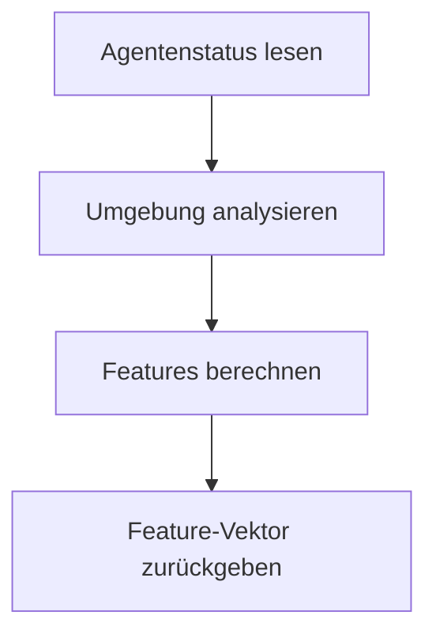

# Flatland Multi-Agent Observations – Übersicht & Feature-Design

Diese Dokumentation beschreibt alle wichtigen Beobachtungsklassen (Observations) für Multi-Agenten-Umgebungen im Flatland-Railway-Setting. Sie legt besonderen Fokus auf die Feature-Struktur, Entscheidungslogik und die Unterschiede zwischen den Klassen. **Jede Klasse wird mit maximaler Detailtiefe, Schritt-für-Schritt-Logik und exakten Feature-Beschreibungen erläutert.**

---

## 1. ExperimentalObservation

**Zweck:**
Die `ExperimentalObservation` ist eine generische, 30-dimensionale Beobachtung für jeden Agenten. Sie liefert eine vollständige Zustandsbeschreibung, die als Basis für komplexere Observations dient.

**Interne Logik & Ablauf:**
1. **Agentenstatus erfassen:** Position, Richtung, Ziel, Status werden aus dem Agentenobjekt gelesen.
2. **Umgebungsanalyse:** Die Umgebung (z.B. Weichen, andere Agenten) wird analysiert, indem Hilfsklassen wie `RailroadSwitchAnalyser` und ein Walker verwendet werden.
3. **Feature-Berechnung:**
	- Die ersten Features kodieren die eigene Position, Richtung, Zielkoordinaten und Status.
	- Weitere Features können Distanzen, Deadlock-Flags, Agenten in der Nähe oder andere relevante Metriken enthalten.
4. **Multi-Agenten-Features:** Optional werden Informationen über andere Agenten (z.B. relative Positionen) ergänzt.

**Feature-Bedeutung (Beispiel):**
| Index | Bedeutung                |
|-------|--------------------------|
| 0     | eigene x-Position        |
| 1     | eigene y-Position        |
| 2     | Richtung                 |
| 3     | Status (enum)            |
| 4     | Handle (Agenten-ID)      |
| ...   | ...                      |

**Ablaufdiagramm:**

---

## 2. DecisionPointObservation

### 2.1 Einleitung und Funktionsweise

Die `DecisionPointObservation` ist die zentrale Beobachtungsklasse für alle kritischen Entscheidungssituationen im Flatland-Setting. Sie liefert einen 30-dimensionalen, klar strukturierten Feature-Vektor, der für jede Situation (Start, Weiche, Merge/Crossing) einen eigenen, disjunkten Block belegt. Ziel ist es, der Policy für jede relevante Richtung eine vollständige, konfliktbewusste Einschätzung zu ermöglichen.

### 2.2 Feature-Block-Übersicht

Der Feature-Vektor ist wie folgt aufgebaut:

| Index | Bedeutung (Switch)         | Bedeutung (Merge/Crossing) |
|-------|----------------------------|----------------------------|
| 0     | decision_type              | decision_type              |
| 1–3   | one-hot [l, f, r]          | one-hot [l, f, r]          |
| 4–7   | left: dist, deadlock, ...  | –                          |
| 8–11  | forward: dist, ...         | –                          |
| 12–15 | right: dist, ...           | –                          |
| 16–19 | reverse: dist, ...         | –                          |
| 20–23 | –                          | forward: dist, ...         |
| 24–27 | –                          | backward: dist, ...        |
| 28    | delta_dist_fwd (Start)     | delta_dist_fwd (Start)     |

Jeder Block ist exklusiv für eine Entscheidungssituation reserviert. Die Werte dist, deadlock, switches, delta_dist sind jeweils im Fließtext unten erklärt.

### 2.3 Entscheidungslogik und Ablauf

1. **Status & Position:** Die aktuelle Position, Richtung und der Status des Agenten werden bestimmt.
2. **Klassifikation:** Mit Hilfe des `RailroadSwitchAnalyser` wird erkannt, ob der Agent startet, auf einer Weiche steht oder sich vor einer Weiche befindet.
3. **Blockauswahl:** Je nach Situation wird der passende Feature-Block belegt.
4. **Richtungsanalyse:** Für jede relevante Richtung werden Navigationsmetriken berechnet (siehe 2.4).
5. **Agenten-Interaktion:** Entgegenkommende Agenten werden erkannt und beeinflussen die Deadlock-Logik.

### 2.4 Algorithmus: _navigate_direction

Die Methode `_navigate_direction` simuliert für jede Richtung, wie ein Agent ab einer gegebenen Position und Richtung bis zum Ziel oder bis zu einem Deadlock navigieren würde. Sie liefert für jede Richtung vier Werte:
- Die Anzahl der Schritte bis zum Ziel (dist, oder -1 bei Deadlock)
- Ein Deadlock-Flag (1 bei Deadlock, sonst 0)
- Die Anzahl der Pfadwechsel (an Weichen)
- Eine Liste aller fremden Agenten, die auf dem Pfad gesehen wurden

Der Ablauf ist wie folgt:
1. Initialisierung aller Zähler und Sets.
2. Iterative Navigation bis Ziel, Deadlock oder max_steps:
	- Ziel erreicht: Rückgabe der Werte.
	- Außerhalb Grid: Deadlock.
	- Transitions bestimmen.
	- Agentenprüfung: Entgegenkommende Agenten → Backtracking und alternative Richtungen.
	- Normale Fortsetzung: Richtung mit minimaler Distanz zum Ziel wählen.
	- Kein Fortschritt: Deadlock.

Die Ergebnisse werden für jede Richtung in die Features 4–19 geschrieben. So erhält die Policy eine vollständige, konfliktbewusste Einschätzung aller Alternativen.

**Zweck:**
Die `DecisionPointObservation` ist für die drei wichtigsten Entscheidungssituationen im Flatland-Setting optimiert: Start, Weiche, Merge/Crossing. Sie liefert einen 30D-Feature-Vektor mit disjunkten Blöcken für jede Situation.

**Schritt-für-Schritt-Logik:**
1. **Agentenstatus & Position bestimmen:** Lies aktuelle Position, Richtung, Ziel und Status.
2. **Entscheidungspunkt klassifizieren:**
	- **Start:** Agent ist im Status READY_TO_DEPART.
	- **Weiche:** Agent steht auf einer Weiche und kann abzweigen (ermittelt mit `RailroadSwitchAnalyser`).
	- **Merge/Crossing:** Agent steht ein Feld vor einer Weiche (ermittelt mit `RailroadSwitchAnalyser`).
3. **Feature-Block wählen:**
	- Für jeden Typ wird ein disjunkter Block im Feature-Vektor belegt.
4. **Features berechnen:**
	- **decision_type (0/1/2/3):** Kodiert die Situation.
	- **one-hot shortest path hint [l, f, r]:** Gibt an, welche Richtung aktuell am günstigsten ist.
	- **Für Weiche:** Für jede Richtung (links, geradeaus, rechts, rückwärts):
	  - dist: Distanz zum Ziel
	  - deadlock: 1, falls Deadlock, sonst 0
	  - switches: Anzahl Pfadwechsel
	  - delta_dist: Distanzdifferenz zum Ziel
	- **Für Merge/Crossing:**
	  - forward/backward: dist, deadlock, switches, delta_dist
	- **Start:** Nur delta_dist_fwd
5. **Agenten-Interaktion:** Während der Navigation werden entgegenkommende Agenten erkannt und in die Deadlock-Logik einbezogen.
---

## 3. SimplifiedPathThreeTierObservation

**Zweck:**
Teilt die Umgebung eines Agenten in drei Pfadsegmente (links, geradeaus, rechts). Für jede Richtung werden identische Feature-Blöcke berechnet. Ein Header enthält State-Informationen und einen one-hot-Hinweis auf den besten Pfad.

**Schritt-für-Schritt-Logik:**
1. **Agentenstatus & Position bestimmen**
2. **Transitions analysieren:** Mit env.rail.get_transitions() werden mögliche Richtungen bestimmt.
3. **Best path hint:** Für jede Richtung wird die Distanz zum Ziel berechnet, der beste Pfad erhält ein one-hot.
4. **Feature-Blöcke:** Für jede Richtung werden N Features berechnet (z.B. Distanz, Deadlock, Zielrichtung).
5. **Header:** Enthält State, Richtung, Position, Ziel, Agentenzahl, best_hint.

**Feature-Bedeutung (Beispiel):**
| Index | Bedeutung           |
|-------|---------------------|
| 0     | State (enum)        |
| 1     | Richtung            |
| 2     | Handle              |
| 3     | x-Position          |
| 4     | y-Position          |
| 5     | Ziel x              |
| 6     | Ziel y              |
| 7     | Agentenzahl         |
| 8-10  | best_hint [l,f,r]   |
| 11+   | Pfad-Features       |

---

## 4. Temporale Multi-Agenten-Observations

### 4.1 TemporalMultiAgentObservation
**Zweck:**
Kombiniert Beobachtungen mehrerer Agenten über mehrere Zeitschritte (z.B. T=3). Jeder Agent erhält eine Historie seiner eigenen Beobachtungen (und ggf. Velocity-Features).

**Ablauf:**
1. **Base-Observation wählen:** Meist DecisionPointObservation oder ExperimentalObservation.
2. **Für jeden Agenten:**
	- Hole aktuelle Beobachtung (obs_t)
	- Füge sie in die Historie (deque) ein
	- Falls Historie < T, padde mit Kopien der ältesten Beobachtung
3. **Velocity-Features:** Aus Positionsdifferenzen werden velocity_x, velocity_y, angular_velocity berechnet.
4. **Rückgabe:** Liste von [(obs_t-2, opp_t-2), (obs_t-1, opp_t-1), (obs_t, opp_t)] pro Agent

**Feature-Bedeutung:**
- Pro Zeitschritt: 30D Basis-Features + 3D Velocity

### 4.2 TemporalMultiAgentSwitchObservation
**Zweck:**
Fokussiert auf Weichen (Switches) im Schienennetz. Enthält explizite Informationen über Weichenpositionen und -zustände über mehrere Zeitschritte.

### 4.3 TemporalMultiAgentSwitchCellObservation
**Zweck:**
Erweitert die vorherige um Informationen zu Zellen, die zu Weichen führen oder in deren Nähe liegen. Unterstützt Überholen und Konfliktlösung.

### 4.4 TemporalMultiAgentSwitchCellWithDirectionObservation
**Zweck:**
Ergänzt die SwitchCellObservation um Richtungsinformationen. Agenten wissen, in welche Richtung sie sich bewegen und welche Abzweigungen möglich sind.

---

## Zusammenfassung

Alle Observations sind darauf ausgelegt, die Entscheidungsfindung der Agenten in komplexen, dynamischen Schienennetzen zu verbessern. Die DecisionPointObservation bietet dabei die fortschrittlichste Entscheidungslogik mit disjunkten, klar nummerierten Feature-Blöcken für alle relevanten Entscheidungstypen. **Jeder Schritt, jede Feature-Bedeutung und jede Entscheidungslogik ist in dieser Dokumentation maximal transparent und nachvollziehbar beschrieben.**

# Flatland Multi-Agent Observations – Übersicht & Feature-Design

Diese Dokumentation beschreibt alle wichtigen Beobachtungsklassen (Observations) für Multi-Agenten-Umgebungen im Flatland-Railway-Setting. Sie legt besonderen Fokus auf die Feature-Struktur, Entscheidungslogik und die Unterschiede zwischen den Klassen.

---

## 1. ExperimentalObservation

**Beschreibung:**
Die `ExperimentalObservation` ist eine generische, 30-dimensionale Beobachtung für jeden Agenten. Sie kombiniert Agenten-Status (Position, Richtung, Ziel, Status) mit einer Analyse der Umgebung und anderer Agenten. Sie ist die Basisklasse für komplexere, temporale oder multi-agentenfähige Beobachtungen.

**Feature-Design:**
- 30-dimensionale Feature-Vektoren (Details siehe Code)
- Enthält keine explizite Entscheidungslogik für Weichen/Merges, sondern gibt eine allgemeine Zustandsbeschreibung zurück.

**Einsatz:**
- Basis für temporale und multi-agentenfähige Observations
- Gut geeignet für klassische RL-Algorithmen

---

## 2. DecisionPointObservation

**Beschreibung:**
Die `DecisionPointObservation` ist speziell für die drei wichtigsten Entscheidungssituationen im Flatland-Setting konzipiert:

1. **Start (READY_TO_DEPART):** Soll der Agent auf das Spielfeld fahren?
2. **An einer Weiche (Switch):** Der Agent steht auf einer Weiche und kann abzweigen (klassische Routing-Entscheidung).
3. **Vor einer Weiche (Merge/Crossing):** Der Agent steht ein Feld vor einer Weiche, kann nicht abzweigen, aber es besteht Konfliktpotenzial (z.B. Einfädeln, Kreuzen, Warten).

**Feature-Vektor (30D, disjunkt):**

| Index    | Bedeutung (decision_type==2, Switch)         | Bedeutung (decision_type==3, Merge/Crossing) |
|----------|----------------------------------------------|----------------------------------------------|
| 0        | decision_type                                | decision_type                                |
| 1–3      | one-hot shortest path hint [l, f, r]         | one-hot shortest path hint [l, f, r]         |
| 4–7      | left: dist, deadlock, switches, delta_dist   | –                                            |
| 8–11     | forward: dist, deadlock, switches, delta_dist| –                                            |
| 12–15    | right: dist, deadlock, switches, delta_dist  | –                                            |
| 16–19    | reverse: dist, deadlock, switches, delta_dist| –                                            |
| 20–23    | –                                            | forward: dist, deadlock, switches, delta_dist |
| 24–27    | –                                            | backward: dist, deadlock, switches, delta_dist|
| 28       | delta_dist_fwd (decision_type==1)            | delta_dist_fwd (decision_type==1)            |

**Logik:**
- Für decision_type==2 (Switch): Für jede Richtung (links, geradeaus, rechts, rückwärts) werden vier Werte gespeichert: dist (Distanz zum Ziel), deadlock (1/0), switches (Pfadwechsel), delta_dist (Distanzdifferenz zum Ziel). Die Blöcke sind im Vektor disjunkt: left (4–7), forward (8–11), right (12–15), reverse (16–19).
- Für decision_type==3 (Merge/Crossing): Für forward (20–23) und backward (24–27) werden jeweils dist, deadlock, switches, delta_dist gespeichert. Die Werte sind analog zu type==2, aber in separaten Blöcken.
- decision_type==1 (Start): Nur decision_type und delta_dist_fwd (28) sind belegt.

**Vorteile:**
- Klare Trennung der Entscheidungslogik
- Disjunkte Feature-Blöcke für verschiedene Entscheidungstypen
- Unterstützt fortschrittliche Navigation, Deadlock-Erkennung und Agenten-Interaktion

---

## 3. SimplifiedPathThreeTierObservation

**Beschreibung:**
Die `SimplifiedPathThreeTierObservation` teilt die Umgebung eines Agenten in drei Pfadsegmente ("Tiers"): links, geradeaus, rechts. Für jede Richtung werden identische Feature-Blöcke berechnet (z.B. Distanz, Deadlock, Zielrichtung). Ein Header enthält State-Informationen und einen one-hot-Hinweis auf den besten Pfad.

**Feature-Design:**
- Header (z.B. State, Richtung, Position, Ziel, Agentenzahl, one-hot best path)
- Drei Blöcke à N Features (z.B. 16) für [links, geradeaus, rechts]

**Einsatz:**
- Gut geeignet für Policies, die explizit zwischen Alternativen wählen
- Übersichtliche, strukturierte Feature-Vektoren

---

## 4. Temporale Multi-Agenten-Observations

### 4.1 TemporalMultiAgentObservation
**Beschreibung:**
Kombiniert die Beobachtungen mehrerer Agenten über mehrere Zeitschritte (z.B. T=3). Jeder Agent erhält eine Historie seiner eigenen Beobachtungen (und ggf. Velocity-Features). Besonders nützlich für Algorithmen mit zeitlichen Abhängigkeiten (z.B. RNNs).

**Feature-Design:**
- Pro Zeitschritt: 30D Basis-Features + 3D Velocity (velocity_x, velocity_y, angular_velocity)
- Rückgabeformat: Liste von (obs_t-2, obs_t-1, obs_t) pro Agent

### 4.2 TemporalMultiAgentSwitchObservation
**Beschreibung:**
Fokussiert auf Weichen (Switches) im Schienennetz. Enthält explizite Informationen über Weichenpositionen und -zustände über mehrere Zeitschritte.

### 4.3 TemporalMultiAgentSwitchCellObservation
**Beschreibung:**
Erweitert die vorherige um Informationen zu Zellen, die zu Weichen führen oder in deren Nähe liegen. Unterstützt Überholen und Konfliktlösung.

### 4.4 TemporalMultiAgentSwitchCellWithDirectionObservation
**Beschreibung:**
Ergänzt die SwitchCellObservation um Richtungsinformationen. Agenten wissen, in welche Richtung sie sich bewegen und welche Abzweigungen möglich sind.

---

## Zusammenfassung

Alle Observations sind darauf ausgelegt, die Entscheidungsfindung der Agenten in komplexen, dynamischen Schienennetzen zu verbessern. Die DecisionPointObservation bietet dabei die fortschrittlichste Entscheidungslogik mit disjunkten, klar nummerierten Feature-Blöcken für alle relevanten Entscheidungstypen.